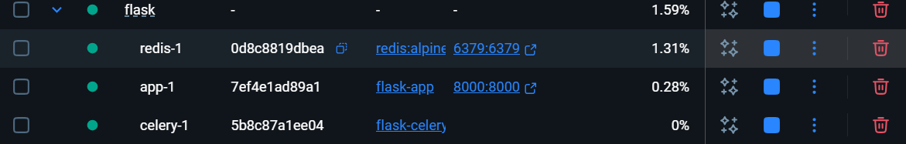
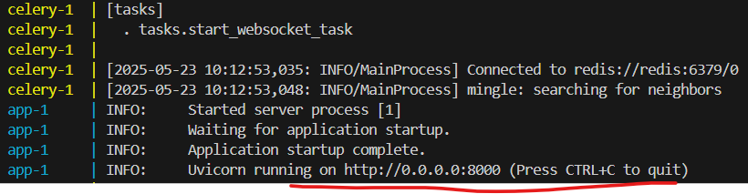

# Python Flask Example

This is a [Flask](https://flask.palletsprojects.com/en/1.1.x/) app that serves a simple JSON response.

[](https://dashboard.render.com/web/new)

## ✨ Features

- Python
- Flask
- Redis
- Celery

## 💁‍♀️ How to start

#### Run locally without Docker:

**1.venv (required foryourapp)**

`python -m venv venv    `   # Create a virtual environment

source venv/bin/activate  # Activate it (Linux/Mac)

OR

`.`

**2.Start Redis (required foryourapp)**

Your app uses Redis for storing data. Start the Redis server in a new terminal window:

```
.\redis-serverredis-server
C:\MyGitHub\flask\redis.conf
```


**3.Start Celery (for WebSockettasks)**

In another terminal (with the virtualenv activated), run:

`celery-Atasksworker--loglevel=info`

**4.Run the FastAPI app with Uvicorn**

`uvicornmain:app--reload`

**5.Access the application**

Your API will be available at:

`http://127.0.0.1:8000`

The /lastdata endpoint:

`http://127.0.0.1:8000/lastdata`

The map view:

`http://127.0.0.1:8000/map`


#### Run with Docker:

`docker-compose build --no-cache`

`docker-compose `

The docker-compose will build and start the containers:



When you see this in the terminal, the app is available, you can visite `http://127.0.0.1:8000/lastdata`.


